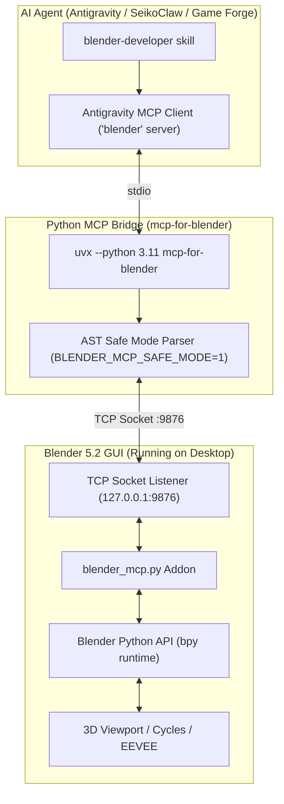

# Blender Developer & 3D Procedural MCP Orchestrator

The **Blender Developer** skill provides autonomous, bi-directional control over a live running Blender 3D instance via the Model Context Protocol (MCP). It enables agents to procedurally generate 3D assets, dress scenes, configure PBR materials, search and import online assets (Poly Haven, Poly Pizza, Sketchfab), and visually inspect rendered results using multi-angle feedback loops.

---

## 1. System Architecture & Connection Protocol



### Connection Requirements:
1. **Blender GUI Active**: Blender must be running with a GUI (commands do not execute in headless `blender -b` without `xvfb`).
2. **Addon Enabled**: `Interface: MCP for Blender` must be active under `Edit -> Preferences -> Add-ons`.
3. **TCP Listener**: Press `N` in the 3D viewport, open the **MCP for Blender** tab, and ensure **Start MCP Server** is running on `127.0.0.1:9876`.
4. **Agent MCP Server**: The `blender` server is registered globally in `~/.gemini/config/mcp_config.json`.

---

## 2. Core Tool Reference

All Blender tools are invoked via `call_mcp_tool` with `ServerName: "blender"`:

### A. Connection & Introspection
- `get_addon_status()`: Verify Blender version, protocol handshake, and active asset providers. Call this first.
- `get_scene_info(fields, query, root, limit)`: Compact structured metadata (transforms, bounding boxes, polygon counts, topology health). Avoids context explosion.
- `disable_telemetry()`: Opt out of usage data collection.

### B. Visual Self-Verification ("The Eyes")
- `look(mode, shading, max_size, target)`:
  - `mode="angles"`: Auto-framed 4-view contact sheet (Front, Side, Top, Iso) for silhouette and proportion checks.
  - `mode="camera"`: Render from the active scene camera.
  - `mode="viewport"`: Live viewport capture.
  - `shading="solid" | "material" | "rendered" | "wireframe" | "xray"`: Inspect geometry topology or bones.
  - `max_size=512`: Token-efficient resolution for iterative loops.

### C. Procedural Python Execution
- `execute_blender_code(code)`: Execute Python code directly in Blender's live `bpy` runtime.

### D. Asset Catalog Search & Generation
- `search_assets(source, query, asset_type)`: Search CC0 textures/HDRIs (**Poly Haven**), low-poly models (**Poly Pizza**), or **Sketchfab**.
- `import_asset(source, id, asset_type, target_size)`: Download and auto-place assets into the scene.
- `generate_3d(prompt, image_url, provider)`: Text-to-3D / Image-to-3D generation (Tripo, Hunyuan3D, Hyper3D Rodin).

---

## 3. Idiomatic BPY Scripting Rules

When writing Python code for `execute_blender_code`, follow these non-negotiable rules:

### 1. Robust Shader Node Lookup (Never Use Localized Names)
Node names like `"Principled BSDF"` vary across languages. Always look up nodes by `node.type`:
```python
import bpy

mat = bpy.data.materials.new(name="M_Armor")
mat.use_nodes = True
nodes = mat.node_tree.nodes
principled = next(n for n in nodes if n.type == "BSDF_PRINCIPLED")

# Set Base Color (RGBA)
principled.inputs["Base Color"].default_value = (0.2, 0.5, 0.8, 1.0)
# Set Roughness & Metallic
principled.inputs["Roughness"].default_value = 0.3
principled.inputs["Metallic"].default_value = 0.9
```

### 2. Mesh Cleanup & Bounding Box Grounding
Never leave imported or generated models floating:
```python
import bpy

obj = bpy.context.active_object
if obj and obj.type == 'MESH':
    # Calculate world bounding box z-min
    bbox_corners = [obj.matrix_world @ mathutils.Vector(corner) for corner in obj.bound_box]
    min_z = min(corner.z for corner in bbox_corners)
    # Snap bottom face to Z = 0 ground plane
    obj.location.z -= min_z
```

### 3. Safe Dynamic Enums
Never hardcode enum identifiers without runtime verification:
```python
import bpy

# Read available render engines dynamically
valid_engines = [item.identifier for item in bpy.types.RenderSettings.bl_rna.properties["engine"].enum_items]
if "CYCLES" in valid_engines:
    bpy.context.scene.render.engine = "CYCLES"
```

---

## 4. Game Asset Export Pipelines

### A. Web / Godot / Unreal glTF Export
```python
import bpy

bpy.ops.export_scene.gltf(
    filepath="d:/DevWorkspace/GameProject/assets/models/character.glb",
    export_format='GLB',
    use_selection=True,
    export_apply=True,
    export_materials='EXPORT',
    export_yup=True
)
```

### B. 8-Directional Isometric Sprite Sheet Rendering
For 2D pixel-art / isometric games, Blender acts as an automated sprite rendering engine:
```python
import bpy
import math

camera = bpy.data.objects['Camera']
angles = [0, 45, 90, 135, 180, 225, 270, 315]

for i, angle in enumerate(angles):
    camera.rotation_euler[2] = math.radians(angle)
    bpy.context.scene.render.filepath = f"d:/DevWorkspace/GameProject/assets/sprites/char_dir_{i}.png"
    bpy.ops.render.render(write_still=True)
```

---

## 5. Verification & Visual Bar Loop

1. **Check Scene**: Call `get_scene_info()` to verify object count and active selections.
2. **Execute Script**: Send procedural generation script via `execute_blender_code`.
3. **Visual Audit**: Call `look(mode="angles")` to capture multi-angle stills.
4. **Topology Audit**: Call `look(shading="wireframe")` to inspect edge flow, quads vs ngons, and manifold boundaries.
5. **Critique**: Compare against reference images in `refs-locked/` or `art/BAR.md`.
