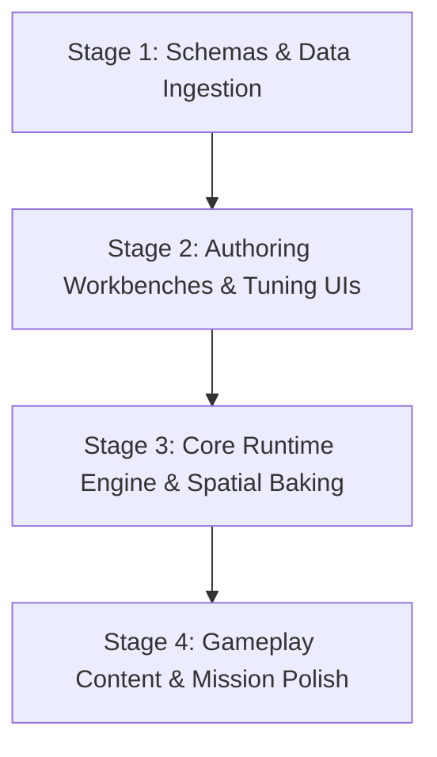

# Game Developer & Tooling Architect

The **Game Developer** skill bridges the gap between high-level game design (from `/game-design-critic`) and project roadmaps (from `/wayfinder`). It operates on a fundamental truth proven in production (and exemplified by projects like `Tactical-Adberrain`):

> **Attempting to build runtime gameplay before building developer tooling leads to chaos, brittle hacks, and stalled projects. Building specialized authoring workbenches, asset pipelines, and schema validators first makes game creation linear, predictable, and modular.**

---

## 1. Input Ingestion

Before questioning or planning, ingest existing project assets:

1. **Game Design Review** (`Game_Design_Review.md` or `GDD.md`):
   - Review locked mechanics, 10s/30s/5m core loops, and aesthetic targets produced by `/game-design-critic`.
2. **Wayfinder Operating Map** (`operating_map.md` or project tickets):
   - Identify the destination, high-level milestones, and existing frontier tickets.
3. **Existing Repository State**:
   - Check existing directories (e.g. `assets/`, `tools/`, `scripts/`, `data/`, `client/`, `services/`) to avoid duplicating existing tooling.

---

## 2. Second-Layer Technical Grilling Protocol

Conduct an interactive, back-and-forth Socratic interview with the user to uncover the hidden tools, authoring interfaces, and pipelines needed.

### Rules of Grilling:
- **Ask 2–3 questions per round** from the [Second-Layer Question Bank](file:///d:/DevWorkspace/SeikoClaw-Harness/.agents/skills/game-developer/references/second_layer_questions.md). Never dump an entire questionnaire at once.
- **Probe for manual friction**: Ask "How will a designer create or place 100 of these?" and "How can this be tested in 5 seconds without playing through the whole campaign?"
- **Cover the 6 Tooling Pillars**:
  1. **Spatial & World Authoring**: Grid geometry, multi-scale LODs, procedural terrain generators, map painters, and spatial baking pipelines.
  2. **Visual Asset Preprocessing**: Automated alpha cleaning (`clean_sprite_transparency.py`), seamless tiling (`make_seamless_tile.py`), sprite packing, and local image generation scripts.
  3. **Sensory & Audio Workbenches**: Standalone Web Audio sound testing decks (`sound_workbench.js`), oscilloscope visualizers, channel mixers, and foley presets.
  4. **Animation, Puppets & Rigging**: 2D modular puppet rigging studios (`rigging_studio.html`), paperdoll attachment layering, and keyframe animation players.
  5. **Content, Lore & Schema Engines**: Structured JSON schemas (quests, dialogue, items), SRD/markdown ingestors (`srd_parser.py`), and data auditors (`validate_vault.py`).
  6. **Developer Staging & Simulators**: Headless battle/balance math testbeds, single-command dev environment orchestration (`start_dev.bat`), and test runners.

---

## 3. Deliverable 1: `GAME_TOOLING_ARCHITECTURE.md`

Once grilling resolves the tooling needs, synthesize a canonical architectural artifact: `docs/design/GAME_TOOLING_ARCHITECTURE.md`.

### Document Structure:
```markdown
# Game Tooling Architecture & Creation Pipeline

## 1. Executive Summary & Tooling Philosophy
- Overview of required tooling suite to enable linear game creation.

## 2. Tooling Inventory & Specifications
Group by category (referencing blueprints from references/tooling_catalog.md):
- **Tool Name** (e.g., `Generator Workbench`, `Sound Workbench`, `Transparency Cleaner`)
- **Type**: Interactive Web Tool (HTML5/Canvas), Python CLI Script, or Service Endpoint.
- **Target Location**: (e.g., `web_client/tools/generator_workbench.html`, `scripts/clean_sprite_transparency.py`)
- **Inputs & Output Schemas**: What data files are consumed and produced.
- **Core Functionality**: Key controls, visual feedback, and export actions.

## 3. Data Schemas & Validation Contracts
- Canonical schemas for game entities (Quests, Dialogues, Characters, Items, Maps).
- Integrity rules enforced by the validation auditor.

## 4. Developer Staging & Environment Orchestration
- Local development startup/teardown commands.
- Build and packaging specs.
```

---

## 4. Deliverable 2: Wayfinder 4-Stage Linear Production Pipeline

Translate the tooling architecture into concrete, staged `/wayfinder` decision tickets and tasks. Staging follows this linear sequence:



### Stage 1: Data Schemas & Ingestion CLI (Data Foundation)
- [ ] Ticket: Define canonical JSON schemas (`quest_schema.json`, `dialogue_schema.json`, `map_schema.json`).
- [ ] Ticket: Build data validation script (`validate_data.py`) to enforce foreign keys and bound limits.
- [ ] Ticket: Build content ingestion/SRD parsers if external rules or lore exist.

### Stage 2: Authoring Workbenches & Tuning UIs (Creation Tools)
- [ ] Ticket: Implement visual map/biome generator workbench or tile painter.
- [ ] Ticket: Implement audio/sensory testing workbench with real-time feedback.
- [ ] Ticket: Implement puppet rigging / animation studio (if characters are modular).
- [ ] Ticket: Implement asset preprocessors (transparency cleaning, seamless texture tiling).

### Stage 3: Core Runtime Engine & Spatial Baking (Engine Integration)
- [ ] Ticket: Build spatial baking service / indexer (R-Tree / chunk loading) to read authored maps.
- [ ] Ticket: Wire runtime audio player to consume authored sound manifests.
- [ ] Ticket: Build skeletal puppet renderer to play authored animation JSON clips.

### Stage 4: Gameplay Content & Mission Polish (Linear Authoring)
- [ ] Ticket: Author game world maps using the Generator Workbench and Map Painter.
- [ ] Ticket: Author quests and NPC dialogue using verified schemas and validators.
- [ ] Ticket: Assemble and balance encounters using live math and balance simulators.

---

## 5. Tool Scaffolding & Starter Blueprints

When building tools during Stage 2, consult [tooling_catalog.md](file:///d:/DevWorkspace/SeikoClaw-Harness/.agents/skills/game-developer/references/tooling_catalog.md) for concrete blueprints:
- **Interactive Browser Tools**: Use standalone HTML5 + Vanilla JS + Canvas 2D / Web Audio. Zero external CDN lock-in so tools work fully offline.
- **CLI Utilities**: Use Python (`uv run`) with standard libraries (`PIL`, `argparse`, `json`, `pathlib`). Always output structured JSON or processed images to files.

---

## 6. Boundaries & Relationships

- **Do NOT** critique game feel, player psychology, or 10-second fun loops: Delegate to `/game-design-critic`.
- **Do NOT** produce single-file playable prototypes: Delegate to `/game-prototype-builder`.
- **Do NOT** tune mathematical balance curves: Delegate to `/game-systems-modeler`.
- **DO** discover, design, specify, and stage the authoring tools, workbenches, pipelines, and validators that allow developers to construct the game smoothly.
