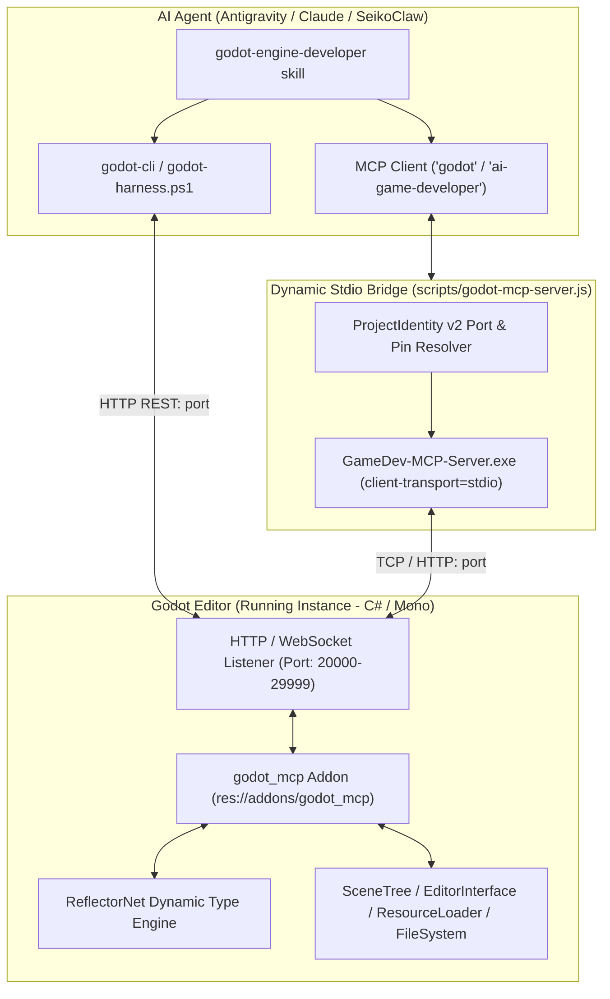
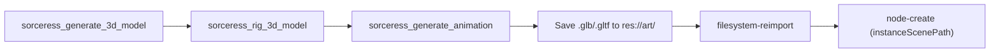

# Godot Engine Developer & Editor MCP Orchestrator

The **Godot Engine Developer** skill provides autonomous, bi-directional control over a live running Godot Engine Editor instance (Godot 4.3+, 4.4, 4.5+ C# / .NET mono) via the Model Context Protocol (MCP) and `godot-cli`. It translates high-level game architecture, Game Design Documents, and mathematical balance models directly into live Godot scenes (`.tscn`), Node hierarchies, Resources (`.tres`), and compiled C# / GDScript scripts without manual editor friction.

---

## 1. System Architecture & Connection Protocol



### Connection Requirements:
1. **Godot Editor Must Be Running**: The project (`project.godot`) must be open in the Godot Editor (Godot 4.3+ mono with .NET 8 SDK).
2. **Godot-MCP Plugin Active**: The `godot_mcp` addon must be installed in `res://addons/godot_mcp/` and enabled under `[editor_plugins]` in `project.godot`.
3. **Deterministic Local Port**: Upon editor launch, the plugin automatically binds a local port derived from the SHA-256 hash of the normalized project path (mapped to range `20000..29999`) and registers its routing pin via ProjectIdentity v2.
4. **Agent MCP Server**: The `godot` and `ai-game-developer` MCP servers are registered in `~/.gemini/antigravity/mcp_config.json` via `node d:\DevWorkspace\SeikoClaw-Harness\scripts\godot-mcp-server.js`.

---

## 2. Project Setup & Quickstart

To prepare any Godot C# project for MCP orchestration, use either the SeikoClaw harness helper or `godot-cli`:

```bash
# Option A: Via SeikoClaw Harness Helper
powershell -ExecutionPolicy Bypass -File .\scripts\godot-harness.ps1 setup D:\DevWorkspace\MyGodotGame
powershell -ExecutionPolicy Bypass -File .\scripts\godot-harness.ps1 open D:\DevWorkspace\MyGodotGame

# Option B: Via godot-cli
# 1. Install addon and managed server
godot-cli install-plugin D:\DevWorkspace\MyGodotGame --with-server
# 2. Enable all tools, prompts, and resources
godot-cli configure D:\DevWorkspace\MyGodotGame --enable-all-tools --enable-all-prompts --enable-all-resources
# 3. Configure Antigravity MCP settings
godot-cli setup-mcp antigravity D:\DevWorkspace\MyGodotGame
# 4. Open Godot editor (builds C# assembly first, then launches)
godot-cli open D:\DevWorkspace\MyGodotGame
# 5. Wait for readiness probe
godot-cli wait-for-ready D:\DevWorkspace\MyGodotGame
```

Verify connection status at any time:
```bash
powershell -ExecutionPolicy Bypass -File .\scripts\godot-harness.ps1 status D:\DevWorkspace\MyGodotGame
```

---

## 3. Core Tool Reference

All Godot MCP tools are callable either via Antigravity MCP (`call_mcp_tool` with `ServerName="godot"`) or via CLI (`godot-cli run-tool <tool-name> --input '<json>'`).

### A. Node & SceneTree Hierarchy Management
- `node-create`: Spawn an empty/typed Node (e.g. `Node3D`, `CharacterBody3D`, `Sprite2D`, `Camera3D`) or instance a `.tscn` sub-scene, with optional parent and sibling order:
  ```json
  {"name": "Player", "typeClassName": "CharacterBody3D", "parentNodeRef": {"name": "World"}}
  ```
- `node-find`: Find nodes in the active scene tree by path, tag, or instance id, with optional `hierarchyDepth`:
  ```json
  {"nodeRef": {"path": "World/Player"}, "hierarchyDepth": 1}
  ```
- `node-modify`: Update fields, transforms, and exported properties on a node via ReflectorNet using `pathPatches` or RFC 7396 `jsonPatch`:
  ```json
  {"nodeRef": {"name": "Player"}, "pathPatches": [{"path": "position", "value": {"X": 0, "Y": 1.5, "Z": 0}}]}
  ```
- `node-set-parent`: Re-parent nodes within the scene tree with optional `keepGlobalTransform` (default `true`).
- `node-reorder`: Move a node to a specific position among siblings (`index`), controlling layout ordering in `VBoxContainer`/`HBoxContainer` or draw ordering in 2D.
- `node-duplicate`: Clone existing nodes and their subtrees.
- `node-delete`: Remove target nodes and their child trees from the scene.

### B. Scene Management & PackedScenes
- `scene-create`: Create a new `.tscn` scene asset with a designated root node type and name, opening it immediately:
  ```json
  {"resourcePath": "res://scenes/MainArena.tscn", "rootTypeClassName": "Node3D", "rootName": "MainArena"}
  ```
- `scene-open`: Open an existing scene in the editor:
  ```json
  {"resourcePath": "res://scenes/MainArena.tscn"}
  ```
- `scene-save`: **Mandatory after edits**: Persist modifications to the active scene file:
  ```json
  {"resourcePath": "res://scenes/MainArena.tscn"}
  ```
- `scene-get-data`: Retrieve root nodes and structured hierarchy data of a scene.
- `scene-list-opened`: List all currently open scenes in the editor tabs.

### C. Resource Pipeline (.tres / .res)
- `resource-create`: Create a new Resource asset file:
  ```json
  {"resourcePath": "res://resources/PlayerStats.tres", "typeClassName": "Resource"}
  ```
- `resource-get-data`: Read serialized properties of a resource asset.
- `resource-modify`: Update properties on a resource using `pathPatches` or `jsonPatch`.
- `resource-find`: Search the project for resources matching queries or types (`"typeClassName": "StandardMaterial3D"`).
- `resource-move`: Rename or move resources while preserving `.import` sidecars.
- `resource-delete`: Delete obsolete resources from the project.

### D. FileSystem & Asset Reimport
- `filesystem-list`: Browse the `res://` tree (file types and UIDs) via the editor file index.
- `filesystem-reimport`: Force an immediate reimport of modified project assets.

### E. Script Authoring & Validation (C# & GDScript)
- `script-create`: Create new `.gd` or `.cs` script files:
  ```json
  {
    "resourcePath": "res://scripts/PlayerController.cs",
    "scriptContent": "using Godot;\n\npublic partial class PlayerController : CharacterBody3D {\n    [Export] public float Speed = 5.0f;\n    public override void _PhysicsProcess(double delta) {\n        // Movement logic\n    }\n}"
  }
  ```
- `script-read`: Read source code of existing script files.
- `script-update`: Replace or patch script file contents.
- `script-validate`: Validate GDScript (`.gd`) files and return structured parse/compile diagnostics before attaching.
- `script-attach-to-node`: Attach a script to a Node in the scene tree:
  ```json
  {"nodeRef": {"name": "Player"}, "scriptResourcePath": "res://scripts/PlayerController.cs"}
  ```
- `script-delete`: Remove script files from the project.

### F. Viewport & Visual Diagnostics
- `screenshot-viewport`: Capture the active Godot Editor Viewport as a PNG for agent visual inspection.
- `screenshot-camera`: Render from a designated camera node (`Camera2D` or `Camera3D`).
- `screenshot-isolated`: Render a target Node in isolation from a chosen viewing angle (`Front`, `Top`, `Iso`, `Composite`).
- `console-get-logs`: Retrieve Godot Editor Console logs, errors, and warnings:
  ```json
  {"logType": "Error", "maxCount": 20}
  ```
- `console-clear-logs`: Clear the Godot Editor Console buffer.
- `editor-application-set-state`: Toggle Playmode (`{"isPlaying": true}`).

### G. Reflection & Dynamic Invocation (ReflectorNet)
- `reflection-method-find`: Discover methods on engine or project types across loaded assemblies.
- `reflection-method-call`: Execute any static or instance method dynamically via ReflectorNet.

### H. In-Game Runtime Error Capture
- `runtime-errors-get`: Poll errors raised inside the **running game** (GDScript runtime errors, `push_error`, unhandled C# exceptions, backtraces):
  ```json
  {"sinceSequence": 0}
  ```
- `runtime-errors-clear`: Clear in-game runtime error buffer.

---

## 4. Production Pipelines

### Pipeline 1: Full Game Forge Integration (`game-forge` Stage E)
When executing Stage E of `/game-forge` targeting Godot Engine:
1. **Ingest Game Design & Specs**: Read `docs/design/GDD.md`, `VERTICAL_SLICE_SPEC.md`, and `docs/design/balance.json`.
2. **Scaffold Project Structure**:
   - `scene-create` for `res://scenes/GameplaySlice.tscn` with root `Node3D` (or `Node2D`) and `scene-open`.
   - Author directory structure: `res://scripts/`, `res://scenes/`, `res://art/`, `res://resources/`.
3. **Scaffold World Geometry & Environment**:
   - Spawn arena bounds, collision shapes (`CollisionShape3D`), static bodies (`StaticBody3D`), lighting (`DirectionalLight3D`, `WorldEnvironment`).
   - Create PBR materials with `resource-create` (`StandardMaterial3D`) and attach to mesh instances (`MeshInstance3D`).
4. **Author Gameplay Scripts**:
   - Write player movement, enemy AI, health systems, and combat loops using `script-create` or `script-update`.
   - Run `godot-cli build` to ensure C# assemblies compile cleanly.
   - Attach scripts to nodes using `script-attach-to-node`.
5. **Assemble Entities & Sub-scenes**:
   - Spawn primitives or imported meshes, attach colliders and scripts.
   - Save character and enemy branches as sub-scenes (`res://scenes/Player.tscn`) via `node-create` with `instanceScenePath`.
6. **Save & Verify**:
   - **Mandatory**: Call `scene-save` to persist all modifications.
   - Verify visually via `screenshot-viewport` and `screenshot-camera`.
   - Launch playmode via `editor-application-set-state` (`isPlaying: true`) and monitor errors with `runtime-errors-get`.

### Pipeline 2: Sorceress 3D & 2D Asset Ingestion Pipeline
Connect assets generated by [`sorceress`](file:///C:/Users/saiko/.gemini/config/skills/sorceress/SKILL.md) directly into Godot:

1. Generate model with `sorceress_generate_3d_model` and download `.glb`.
2. Save file into `res://art/characters/` and call `filesystem-reimport`.
3. Instantiate in scene with `node-create` using `instanceScenePath: "res://art/characters/hero.glb"`.

### Pipeline 3: Systems Modeler Balance Synchronization
Connect mathematical models from [`game-systems-modeler`](file:///d:/DevWorkspace/SeikoClaw-Harness/.agents/skills/game-systems-modeler/SKILL.md) (`docs/design/balance.json`):
1. Parse authoritative combat formulas (TTK, Damage scaling, XP curves).
2. Generate C# or GDScript custom `Resource` definitions (e.g. `res://scripts/CombatBalanceConfig.cs` or `.gd`).
3. Create corresponding `.tres` Resource instances with `resource-create` and update values via `resource-modify`.

---

## 5. Execution Rules & Best Practices

1. **Coordinate System Discipline**:
   - **Godot 3D uses a Right-Handed coordinate system**:
     - $+X$ = Right
     - $+Y$ = Up
     - $+Z$ = Back (towards camera / viewer)
     - $-Z$ = Forward
   - Units: **1 unit = 1 meter**.
   - **Godot 2D uses Screen Coordinates**:
     - $+X$ = Right
     - $+Y$ = Down
     - Origin $(0, 0)$ is top-left.
2. **Existence Verification First**:
   - Always run `node-find` or `resource-find` before attempting to modify or delete objects.
3. **Strict Scene Saving Discipline**:
   - Modifying nodes or properties leaves the scene in memory.
   - **Always call `scene-save`** immediately after completing a batch of scene edits before entering PlayMode or switching scenes.
4. **Node Owner Assignment**:
   - For child nodes to be serialized into the `.tscn` file, their `owner` must be set to the scene root. `node-create` handles this automatically.
5. **C# Assembly Reload & Build Discipline**:
   - When authoring `.cs` scripts in Godot, C# must be built out-of-band via `dotnet build` or `godot-cli build`.
   - Call `godot-cli build <project>` before attaching new C# scripts to nodes.

---

## 6. Troubleshooting & Health Checks

| Symptom | Cause | Remediation |
| :--- | :--- | :--- |
| **`Connection refused on port 2XXXX`** | Godot Editor is not running with this project | Launch the project via `godot-cli open <path>` or `godot-harness.ps1 open <path>`. |
| **`Godot is not running with this project`** | Project path mismatch or missing `project.godot` | Check `godot-harness.ps1 status <path>`; ensure Godot is opened on the exact project path. |
| **`Unable to load addon script / Disabling addon`** | C# assembly not compiled before editor opened | Run `godot-cli build <path>`, then re-open via `godot-cli open <path>`. |
| **`Server binary not found`** | `gamedev-mcp-server.exe` missing | Run `godot-cli install-plugin <path> --with-server` to download and checksum-verify the managed binary. |
| **`Node not found in scene`** | Path syntax or root mismatch | Use `node-find` with `hierarchyDepth: 1` to inspect exact names and hierarchy. |
| **`Scene modifications not persisting`** | `scene-save` was not called | Always invoke `scene-save` after node creation, modification, or reordering. |
