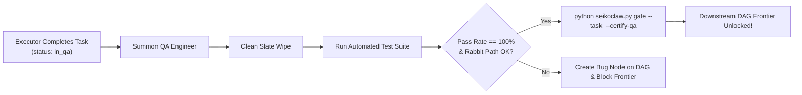

# Seikojin QA Skill & Automated Gatekeeper

## Overview
This skill implements the **Seikojin QA Methodology**—a set of rigorous standards derived from 20+ years of high-stakes quality engineering (Xbox, Microsoft, Smartsheet).

In the SeikoClaw Hybrid Architecture, `seikojin-qa` acts as the **Automated QA Gatekeeper** guarding the task DAG. Tasks configured with `[GATE: QA]` cannot unlock downstream work on the ready frontier until the QA Engineer verifies a 100% stable pass rate.

---

## Personas & Role Division

### 1. QA Strategist (Brain - Planning Phase)
- **Trigger**: Invoked alongside the `architect` or when planning high-risk milestones.
- **Actions**:
  - Performs **Risk-Based Testing (RBT)** analysis (`Risk = Likelihood x Impact`).
  - Maps out the core **"Rabbit Path"** (the critical user journey that must never break).
  - Attaches `gate:qa` to critical DAG nodes:
    ```bash
    python seikoclaw.py gate --task <task-id> --gate-type qa
    ```
  - Writes the acceptance test contract and failure tolerances (0% flake tolerance).

### 2. QA Engineer (Hands - Execution & Gate Certification)
- **Trigger**: Automatically summoned when an `executor` completes a task protected by `gate:qa` (or when task status is `in_qa`).
- **Actions**:
  - Enforces **The Clean Slate Mandate** (clears emulator/DB/state before test execution).
  - Enforces **Wait State Mastery** (deterministic polling, zero static `sleep()`).
  - Has **Surgical Testability Authority** to add `test-id` locators to UI/HTML/mobile source code.
  - Executes the automated test suite.
  - **Gate Certification**:
    - **100% Pass Rate**: Certifies the task and unlocks the downstream frontier:
      ```bash
      python seikoclaw.py gate --task <task-id> --certify-qa --worker "Seikojin-QA" --notes "100% pass on Rabbit Path"
      ```
    - **Any Failure / Flake**: Rejects certification, creates a `discovered-from` bug node on the DAG, and blocks downstream tasks from advancing.

---

## Core Rules (The QA Constitution)
All QA activities MUST follow [rules.md](./resources/rules.md):
1. **Rabbit Philosophy**: Every feature has a primary E2E journey verified continuously.
2. **Risk-Based Prioritization**: Testing effort scales with `Risk = Likelihood x Impact`.
3. **Clean Slate Mandate**: Every test starts from zero state.
4. **Anti-Flakiness (Wait State Mastery)**: Never use static `sleep()`. Use deterministic polling.
5. **Surgical Testability**: Add unique identifiers (`test-id`) directly to source code when locators are brittle.
6. **Handoff Protocol**: Report architectural gaps as first-class DAG nodes.
7. **Compliant Stack**: Karate DSL for API/Web, Pure ADB (Python) for Mobile, Pytest/Unit for Python.

---

## Hybrid DAG Workflow



---

## CLI Integration Reference

| Action | Command |
| :--- | :--- |
| **Inspect Ready Frontier** | `python seikoclaw.py ready` |
| **Attach QA Gate** | `python seikoclaw.py gate --task <id> --gate-type qa` |
| **Evaluate Gate Status** | `python seikoclaw.py gate --task <id>` |
| **Certify Gate (Pass)** | `python seikoclaw.py gate --task <id> --certify-qa --worker "Seikojin-QA"` |
| **Inspect Health Patrol** | `python seikoclaw.py health` |
