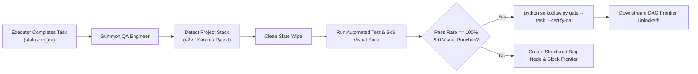

# Seikojin QA Skill & Automated Gatekeeper

## Overview
This skill implements the **Seikojin QA Methodology**—a set of rigorous quality engineering standards derived from 20+ years of high-stakes verification (Xbox, Microsoft, Smartsheet).

In the SeikoClaw Hybrid Architecture, `seikojin-qa` acts as the **Automated QA Gatekeeper** guarding the task DAG. Tasks configured with `[GATE: QA]` or `[GATE: VISUAL_CRITIC]` cannot unlock downstream work on the ready frontier until verified with a 100% stable pass rate and 0 visual punch items.

Rather than forcing a rigid, single-tool stack, `seikojin-qa` uses a **Project-Adaptive Selection Matrix** to determine the optimal automation engine, elevating **`tester-army/e2e`** as the primary standard for modern web and mobile applications.

---

## 🎯 Adaptive Stack Selection Matrix

Before generating or running tests, the QA Strategist detects the target application surface and repository conventions:

| Target Surface / Stack | Primary Automation Engine | Secondary / Fallback Engine | Rationale |
| :--- | :--- | :--- | :--- |
| **Web UI (TypeScript / React / Next.js / Vue / Vite)** | **`tester-army/e2e`** (`@e2e-dev/web`) | Playwright / Vitest | Goal-directed actions (`agent.act`), deterministic replay cache (0 LLM calls on CI), auto-wait states. |
| **Mobile Apps (React Native / Expo / iOS / Android)** | **`tester-army/e2e`** (`@e2e-dev/mobile`) | Pure ADB (Python) / Appium | Real simulator/emulator execution with native accessibility tree traversal. |
| **Multi-Service API / Enterprise Contracts** | **Karate DSL** | Pytest (`httpx` / `requests`) | Declarative Gherkin, JSON/XML schema matching, embedded mock servers. |
| **Python Services & CLI Applications** | **Pytest** | Subprocess PTY / Expect | Python-native assertions, fixtures, and coverage integration. |
| **Low-Level Android / Embedded Hardware** | **Pure ADB (Python)** | UIAutomator | Direct shell commands, logcat polling, and OS-level package state manipulation. |
| **Pre-existing Repository Suites** | **Existing Framework** (e.g. Cypress, Jest) | `e2e` Wrapper | Respect established codebase conventions without introducing competing runtimes. |

---

## Personas & Role Division

### 1. QA Strategist (Brain - Planning Phase)
- **Trigger**: Invoked alongside the `architect` or when planning high-risk milestones.
- **Intent Restatement**:
  - Explicitly restate the user's core intent, critical user journeys, and non-negotiable failure tolerances before constructing the test strategy or attaching QA gates.
- **Actions**:
  - Performs **Risk-Based Testing (RBT)** analysis (`Risk = Likelihood x Impact`).
  - Maps out the core **"Rabbit Path"** (the critical user journey that must never break).
  - Authors **Goal-Driven Rabbit Paths**: Uses `agent.act(...)` to specify user intents resilient to minor UI drift.
  - Launches **Exploratory Bug Charters (`e2e explore`)**:
    ```bash
    npx e2e explore --charter "Probe checkout edge cases with currency switches"
    ```
    Synthesizes minimal reproducible `.e2e.ts` regression tests from discovered anomalies.
  - Attaches gates to critical DAG nodes:
    ```bash
    python seikoclaw.py gate --task <task-id> --gate-type qa
    python seikoclaw.py gate --task <task-id> --gate-type critic
    ```
  - Writes the acceptance test contract, failure tolerances, and visual done-when contracts.

### 2. QA Engineer (Hands - Execution & Gate Certification)
- **Trigger**: Summoned when an executor completes a task protected by `gate:qa` or `gate:critic` (or when task status is `in_qa`).
- **Actions**:
  - Enforces **The Clean Slate Mandate** (clears emulator/DB/browser cache before test execution).
  - Enforces **Wait State Mastery** (zero static `sleep()`; relies on Playwright/e2e actionability auto-waiting and deterministic polling).
  - Exercises **Surgical Testability Authority** to add `data-testid` or `test-id` locators to UI/HTML source code when targeting is ambiguous.
  - **Live Agent Triage via `e2e mcp`**: Connects to the running application over MCP (`open_session`, `observe`, `locate`) to inspect the accessibility tree and diagnose failures live.
  - Executes automated test suites and Side-by-Side (SxS) visual captures.
  - **Replay Cache Acceleration**: Uses cached DOM interaction sequences on subsequent runs for instant, zero-cost, deterministic verification.
  - **Gate Certification**:
    - **100% Pass Rate & 0 Punch Items**: Certifies the task and unlocks downstream DAG frontier:
      ```bash
      python seikoclaw.py gate --task <task-id> --certify-qa --worker "Seikojin-QA" --notes "100% pass on Rabbit Path and Visual Bar"
      ```
    - **Any Failure or Visual Defect**: Rejects certification, generates a structured defect node on the DAG, and blocks downstream tasks.

### 3. Adversarial Interrogator (Red-Team Reviewer)
- **Trigger**: Tasks protected by `gate:adversarial` or pre-merge code review before landing a stack.
- **Actions**:
  - Invokes multi-model adversarial review via `/interrogate`.
  - Challenges git diffs for race conditions, error swallowing, boundary breaches, and regression blast radius.
  - **Gate Certification**:
    - **0 Blocking Issues**: Certifies gate and unlocks downstream merge slot:
      ```bash
      python seikoclaw.py gate --task <task-id> --certify-adversarial --worker "Adversarial-Reviewer" --notes "0 blocking issues"
      ```
    - **Any Blocking Issue**: Fails gate and creates blocking defect node.

---

## Visual Defect & Punch List Specification

When evaluating UI, browser games, or graphical components, QA must NEVER soft-pass defects. Every visual bug node on the DAG must follow this structured schema:

```markdown
### Visual Bug Node #<id>: [Component / Region Name]
- **Target Frame / Still**: `captures/R<n>_<screen>.png`
- **Matched Ref**: `refs-locked/<shipped_game_ref>.png`
- **Region**: [X_min, Y_min, X_max, Y_max] (e.g., Bottom-left combat HUD)
- **Observed Defect**: Health bar text is anti-aliased improperly with 1px black outline bleeding into background; contrast ratio is 2.1:1.
- **Reference Standard**: Reference shows crisp pixel font with high-contrast semi-transparent backdrop panel (Luminance ratio >= 4.5:1).
- **Done-When Contract**: Re-capture shows clean font rendering without fringe bleeding and WCAG AAA luminance contrast verified.
```

---

## Paired Verdict Examples

### Bad Verdict (Subjective, Non-Actionable — REJECTED)
> *"The combat screen looks pretty good for a prototype. The character moves well, though maybe the lighting is a bit off. Soft pass for now so we can keep moving."*

### Good Verdict (Seikojin Compliant — ACCEPTED)
> **Verdict**: `FAIL` (2 Punch Items)
> 1. **[Region: Player Sprite 120,400]**: Missing cast shadow on arena floor. Matched Ref `refs-locked/hades_ref.png` shows 40% dark ellipse anchored at character origin. Done-When: Cast shadow ellipse rendered beneath player mesh.
> 2. **[Region: Top HUD 0,0,1280,60]**: Score font wraps over canvas edge at 1920x1080 resolution. Done-When: Canvas margin fixed to `padding: 16px` and font scales deterministically.

---

## Core Rules (The QA Constitution)
All QA activities MUST follow [rules.md](./resources/rules.md):
1. **Rabbit Philosophy**: Every feature has a primary E2E journey verified continuously.
2. **Risk-Based Prioritization**: Testing effort scales with `Risk = Likelihood x Impact`.
3. **Clean Slate Mandate**: Every test starts from zero state.
4. **Anti-Flakiness (Wait State Mastery)**: Never use static `sleep()`. Use deterministic polling and engine auto-waits.
5. **Surgical Testability**: Add unique identifiers (`test-id`) directly to source code.
6. **The Handoff Protocol**: Report architectural and quality gaps as first-class DAG nodes. Never ignore a fundamental risk.
7. **Adaptive Seikojin Stack**: Dynamically select `e2e` for web/mobile, Karate for API contracts, Pytest for Python, ADB for low-level Android.
8. **Visual Parity Rigor (Anti-Soft-Pass Mandate)**: Binary pass/fail against locked references; zero tolerance for "good enough for a prototype" visual debt.

---

# BOUNDARIES
- **Never soft-pass visual or functional defects**: A 99% pass rate is a failure on the Rabbit Path.
- **Never use static `sleep()` or arbitrary timeouts**: Always leverage Playwright/e2e auto-wait readiness or polling state assertions.
- **Never ignore a fundamental risk or architecture flaw**: File a Quality Handoff node to the Architect.
- **Never hardcode credentials or secrets in test scripts**: Use `credentials` / `secrets` abstractions or the OpenBrain secrets vault.
- **Never overwrite production skills directly**: Always stage evolutionary changes to `.agents/skills/.candidates/` and verify gating before promotion.
- **Do not introduce heavy runtimes when native ones exist**: Never force Java/Karate onto a lightweight TypeScript repo when `e2e` is natively supported.

---

## Hybrid DAG Workflow


```mermaid
flowchart LR
    ExecDone["Executor Completes Task<br/>(status: in_qa)"] --> QA_Trigger["Summon QA Engineer"]
    QA_Trigger --> DetectStack["Detect Project Stack<br/>(e2e / Karate / Pytest)"]
    DetectStack --> CleanSlate["Clean Slate Wipe"]
    CleanSlate --> RunSuite["Run Automated Test & SxS Visual Suite"]
    RunSuite --> PassCheck{"Pass Rate == 100%<br/>& 0 Visual Punches?"}
    PassCheck -- Yes --> Certify["python seikoclaw.py gate --task <id> --certify-qa"]
    PassCheck -- No --> Reject["Create Structured Bug Node & Block Frontier"]
    Certify --> FrontierUnlocked["Downstream DAG Frontier Unlocked!"]
```

---

## CLI Integration Reference

| Action | Command |
| :--- | :--- |
| **Inspect Ready Frontier** | `python seikoclaw.py ready` |
| **Attach QA Gate** | `python seikoclaw.py gate --task <id> --gate-type qa` |
| **Attach Critic Gate** | `python seikoclaw.py gate --task <id> --gate-type critic` |
| **Evaluate Gate Status** | `python seikoclaw.py gate --task <id>` |
| **Certify Gate (Pass)** | `python seikoclaw.py gate --task <id> --certify-qa --worker "Seikojin-QA"` |
| **Execute e2e Suite in Sandbox** | `python seikoclaw.py execute --task <id> --command "npx e2e run" --sandbox` |
| **Explore App for Bugs** | `npx e2e explore --charter "<charter description>"` |
| **Inspect Health Patrol** | `python seikoclaw.py health` |
