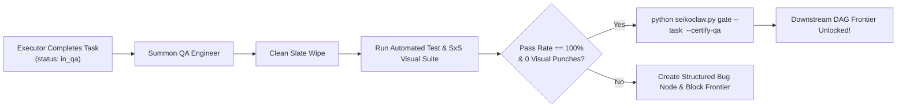

# Seikojin QA Skill & Automated Gatekeeper

## Overview
This skill implements the **Seikojin QA Methodology**—a set of rigorous standards derived from 20+ years of high-stakes quality engineering (Xbox, Microsoft, Smartsheet).

In the SeikoClaw Hybrid Architecture, `seikojin-qa` acts as the **Automated QA Gatekeeper** guarding the task DAG. Tasks configured with `[GATE: QA]` or `[GATE: VISUAL_CRITIC]` cannot unlock downstream work on the ready frontier until verified with a 100% stable pass rate and 0 visual punch items.

---

## Personas & Role Division

### 1. QA Strategist (Brain - Planning Phase)
- **Trigger**: Invoked alongside the `architect` or when planning high-risk milestones.
- **Intent Restatement**:
  - Explicitly restate the user's core intent, critical user journeys, and non-negotiable failure tolerances before constructing the test strategy or attaching QA gates.
- **Actions**:
  - Performs **Risk-Based Testing (RBT)** analysis (`Risk = Likelihood x Impact`).
  - Maps out the core **"Rabbit Path"** (the critical user journey that must never break).
  - Attaches gates to critical DAG nodes:
    ```bash
    python seikoclaw.py gate --task <task-id> --gate-type qa
    python seikoclaw.py gate --task <task-id> --gate-type critic
    ```
  - Writes the acceptance test contract, failure tolerances, and visual done-when contracts.

### 2. QA Engineer (Hands - Execution & Gate Certification)
- **Trigger**: Summoned when an executor completes a task protected by `gate:qa` or `gate:critic` (or when task status is `in_qa`).
- **Actions**:
  - Enforces **The Clean Slate Mandate** (clears emulator/DB/browser cache before test execution).
  - Enforces **Wait State Mastery** (deterministic polling, zero static `sleep()`).
  - Has **Surgical Testability Authority** to add `test-id` locators to UI/HTML source code.
  - Executes automated test suites and Side-by-Side (SxS) visual captures.
  - **Gate Certification**:
    - **100% Pass Rate & 0 Punch Items**: Certifies the task and unlocks downstream DAG frontier:
      ```bash
      python seikoclaw.py gate --task <task-id> --certify-qa --worker "Seikojin-QA" --notes "100% pass on Rabbit Path and Visual Bar"
      ```
    - **Any Failure or Visual Defect**: Rejects certification, generates a structured defect node on the DAG, and blocks downstream tasks.

---

## Visual Defect & Punch List Specification

When evaluating UI, browser games, or graphical components, QA must NEVER soft-pass defects. Every visual bug node on the DAG must follow this structured schema:

```markdown
### Visual Bug Node #<id>: [Component / Region Name]
- **Target Frame / Still**: `captures/R<n>_<screen>.png`
- **Matched Ref**: `refs-locked/<shipped_game_ref>.png`
- **Region**: [X_min, Y_min, X_max, Y_max] (e.g., Bottom-left combat HUD)
- **Observed Defect**: Health bar text is anti-aliased improperly with 1px black outline bleeding into background; contrast ratio is 2.1:1.
- **Reference Standard**: Reference shows crisp pixel font with high-contrast semi-transparent backdrop panel (Luminance ratio >= 4.5:1).
- **Done-When Contract**: Re-capture shows clean font rendering without fringe bleeding and WCAG AAA luminance contrast verified.
```

---

## Paired Verdict Examples

### Bad Verdict (Subjective, Non-Actionable — REJECTED)
> *"The combat screen looks pretty good for a prototype. The character moves well, though maybe the lighting is a bit off. Soft pass for now so we can keep moving."*

### Good Verdict (Seikojin Compliant — ACCEPTED)
> **Verdict**: `FAIL` (2 Punch Items)
> 1. **[Region: Player Sprite 120,400]**: Missing cast shadow on arena floor. Matched Ref `refs-locked/hades_ref.png` shows 40% dark ellipse anchored at character origin. Done-When: Cast shadow ellipse rendered beneath player mesh.
> 2. **[Region: Top HUD 0,0,1280,60]**: Score font wraps over canvas edge at 1920x1080 resolution. Done-When: Canvas margin fixed to `padding: 16px` and font scales deterministically.

---

## Core Rules (The QA Constitution)
All QA activities MUST follow [rules.md](./resources/rules.md):
1. **Rabbit Philosophy**: Every feature has a primary E2E journey verified continuously.
2. **Risk-Based Prioritization**: Testing effort scales with `Risk = Likelihood x Impact`.
3. **Clean Slate Mandate**: Every test starts from zero state.
4. **Anti-Flakiness (Wait State Mastery)**: Never use static `sleep()`. Use deterministic polling.
5. **Surgical Testability**: Add unique identifiers (`test-id`) directly to source code.
6. **The Handoff Protocol**: Report architectural and quality gaps as first-class DAG nodes.
7. **Compliant Stack**: Karate DSL for API/Web, Pure ADB (Python) for Mobile, Pytest for Python.
8. **Visual Parity Rigor (Anti-Soft-Pass)**: Binary pass/fail against locked references; zero tolerance for "good enough for a prototype" visual debt.

---

## Hybrid DAG Workflow


```mermaid
flowchart LR
    ExecDone["Executor Completes Task<br/>(status: in_qa)"] --> QA_Trigger["Summon QA Engineer"]
    QA_Trigger --> CleanSlate["Clean Slate Wipe"]
    CleanSlate --> RunSuite["Run Automated Test & SxS Visual Suite"]
    RunSuite --> PassCheck{"Pass Rate == 100%<br/>& 0 Visual Punches?"}
    PassCheck -- Yes --> Certify["python seikoclaw.py gate --task <id> --certify-qa"]
    PassCheck -- No --> Reject["Create Structured Bug Node & Block Frontier"]
    Certify --> FrontierUnlocked["Downstream DAG Frontier Unlocked!"]
```

---

## CLI Integration Reference

| Action | Command |
| :--- | :--- |
| **Inspect Ready Frontier** | `python seikoclaw.py ready` |
| **Attach QA Gate** | `python seikoclaw.py gate --task <id> --gate-type qa` |
| **Attach Critic Gate** | `python seikoclaw.py gate --task <id> --gate-type critic` |
| **Evaluate Gate Status** | `python seikoclaw.py gate --task <id>` |
| **Certify Gate (Pass)** | `python seikoclaw.py gate --task <id> --certify-qa --worker "Seikojin-QA"` |
| **Inspect Health Patrol** | `python seikoclaw.py health` |
