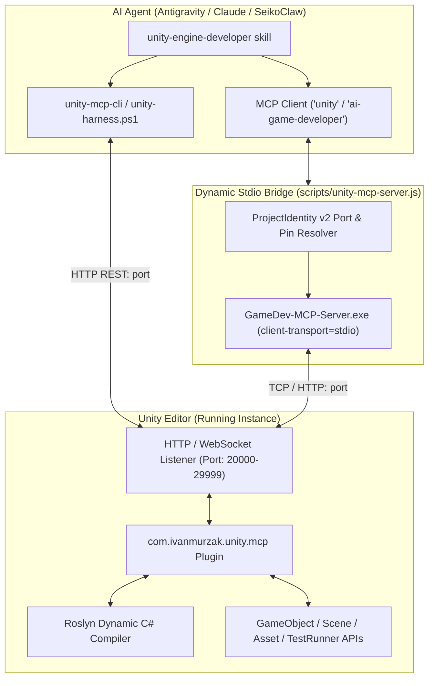
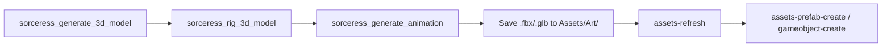

# Unity Engine Developer & Editor MCP Orchestrator

The **Unity Engine Developer** skill provides autonomous, bi-directional control over a live running Unity Editor instance (Unity 2022.3 LTS, 6000.x / Unity 6+) via the Model Context Protocol (MCP) and `unity-mcp-cli`. It translates high-level game architecture, Game Design Documents, and mathematical balance models directly into live Unity scenes, GameObjects, Prefabs, and compiled C# scripts without manual editor friction.

---

## 1. System Architecture & Connection Protocol



### Connection Requirements:
1. **Unity Editor Must Be Running**: The project must be open in the Unity Editor.
2. **Unity-MCP Plugin Active**: The `com.ivanmurzak.unity.mcp` package must be installed in `Packages/manifest.json`.
3. **Deterministic Local Port**: Upon editor launch, the plugin automatically binds a local port derived from the SHA-256 hash of the project path (mapped to range `20000..29999`).
4. **Agent MCP Server**: The `unity` and `ai-game-developer` MCP servers are registered in `~/.gemini/antigravity/mcp_config.json` via `node d:\DevWorkspace\SeikoClaw-Harness\scripts\unity-mcp-server.js`.

---

## 2. Project Setup & Quickstart

To prepare any Unity project for MCP orchestration, use either the CLI or the harness helper:

```bash
# Option A: Via SeikoClaw Harness Helper
powershell -ExecutionPolicy Bypass -File .\scripts\unity-harness.ps1 setup D:\DevWorkspace\MyGame
powershell -ExecutionPolicy Bypass -File .\scripts\unity-harness.ps1 open D:\DevWorkspace\MyGame

# Option B: Via unity-mcp-cli
unity-mcp-cli install-plugin D:\DevWorkspace\MyGame --with-server
unity-mcp-cli configure D:\DevWorkspace\MyGame --enable-all-tools --enable-all-prompts --enable-all-resources
unity-mcp-cli setup-mcp antigravity D:\DevWorkspace\MyGame --transport stdio
unity-mcp-cli open D:\DevWorkspace\MyGame
unity-mcp-cli wait-for-ready D:\DevWorkspace\MyGame
```

Verify connection status at any time:
```bash
powershell -ExecutionPolicy Bypass -File .\scripts\unity-harness.ps1 status D:\DevWorkspace\MyGame
```

---

## 3. Core Tool Reference

All Unity MCP tools are callable either via Antigravity MCP (`call_mcp_tool` with `ServerName="unity"`) or via CLI (`unity-mcp-cli run-tool <tool-name> --input '<json>'`).

### A. GameObject & Hierarchy Management
- `gameobject-create`: Spawn an empty GameObject or primitive (`Cube`, `Sphere`, `Capsule`, `Cylinder`, `Plane`, `Quad`) with optional parent and initial transform:
  ```json
  {"name": "Hero", "primitiveType": "Cube", "position": {"x": 0, "y": 1, "z": 0}}
  ```
- `gameobject-find`: Find GameObjects in the active scene or opened Prefab by name, tag, or hierarchy path (`"query": "Player"`).
- `gameobject-modify`: Update transform position, rotation, scale, active state, tag, or layer:
  ```json
  {"target": {"name": "Hero"}, "position": {"x": 5, "y": 0, "z": 10}, "activeSelf": true}
  ```
- `gameobject-destroy`: Destroy target GameObject and all recursive children.
- `gameobject-duplicate`: Clone existing GameObjects in the scene or opened prefab.
- `gameobject-set-parent`: Re-parent GameObjects within the scene hierarchy with optional `worldPositionStays`.

### B. Component Authoring & Property Manipulation
- `gameobject-component-add`: Attach any Component (`Rigidbody`, `BoxCollider`, `AudioSource`, `Light`, or custom MonoBehaviour):
  ```json
  {"target": {"name": "Hero"}, "componentType": "UnityEngine.Rigidbody"}
  ```
- `gameobject-component-modify`: Configure serialized fields and properties on a component:
  ```json
  {"target": {"name": "Hero"}, "componentType": "UnityEngine.Rigidbody", "properties": {"mass": 5.0, "useGravity": true}}
  ```
- `gameobject-component-get`: Read serialized inspection details and current values of a component.
- `gameobject-component-destroy`: Remove specific components from a GameObject.
- `gameobject-component-list-all`: Query all available `UnityEngine.Component` subclasses in loaded assemblies.

### C. Scene Management
- `scene-create`: Create a new Scene asset (`{"scenePath": "Assets/Scenes/MainArena.unity"}`).
- `scene-open`: Open a scene in the Editor (`{"scenePath": "Assets/Scenes/MainArena.unity", "openMode": "Single"}`).
- `scene-save`: **Mandatory after edits**: Persist modifications to the active scene file.
- `scene-get-data`: Retrieve root GameObjects and hierarchy structure of a scene.
- `scene-set-active`: Switch the designated scene to active.
- `scene-list-opened`: List all currently open scenes in the Editor.

### D. Asset & Prefab Pipeline
- `assets-create-folder`: Create folders in `Assets/` (`{"parentFolder": "Assets", "newFolderName": "Scripts"}`).
- `assets-material-create`: Create a new Material asset with shader assignment (`{"materialPath": "Assets/Materials/HeroMat.mat", "shaderName": "Standard"}`).
- `assets-find`: Search the AssetDatabase with filters (`"filter": "t:Prefab Hero"` or `"filter": "t:Texture2D"`).
- `assets-prefab-create`: Convert a scene GameObject into a reusable Prefab asset:
  ```json
  {"target": {"name": "Hero"}, "prefabPath": "Assets/Prefabs/Hero.prefab"}
  ```
- `assets-prefab-instantiate`: Spawn a Prefab into the active scene:
  ```json
  {"prefabPath": "Assets/Prefabs/Hero.prefab", "position": {"x": 0, "y": 0, "z": 0}}
  ```
- `assets-refresh`: Force an immediate `AssetDatabase.Refresh()` and compilation pass.

### E. Dynamic C# Scripting & Roslyn Execution
- `script-execute`: Compiles and executes C# snippets dynamically using Roslyn directly inside the Unity Editor process!
  - **Body-Only Mode** (`isMethodBody=true`): Automatically injects `using UnityEngine;`, `using UnityEditor;`, and class scaffolding:
    ```json
    {
      "csharpCode": "var hero = GameObject.Find(\"Hero\"); hero.transform.position = new Vector3(0, 5, 0); Debug.Log(\"Hero moved!\");",
      "isMethodBody": true
    }
    ```
  - **Full-Class Mode** (`isMethodBody=false`): Define a complete class with a static method.
- `script-update-or-create`: Create or rewrite permanent `.cs` script files in `Assets/Scripts/`:
  ```json
  {
    "filePath": "Assets/Scripts/PlayerController.cs",
    "csharpCode": "using UnityEngine;\n\npublic class PlayerController : MonoBehaviour {\n    public float speed = 5f;\n    void Update() {\n        float h = Input.GetAxis(\"Horizontal\");\n        float v = Input.GetAxis(\"Vertical\");\n        transform.Translate(new Vector3(h, 0, v) * speed * Time.deltaTime);\n    }\n}"
  }
  ```
- `script-read`: Read source code of scripts.
- `script-delete`: Remove scripts from the project.
- `reflection-method-call`: Execute any static or instance method across loaded assemblies via C# reflection.

### F. Testing & Quality Verification
- `tests-run`: Execute Unity Test Framework tests (`EditMode` or `PlayMode`) with filtering:
  ```json
  {"testMode": "EditMode", "includePassingTests": false, "includeMessages": true}
  ```
  Returns total, passed, failed counts, stack traces, and test execution duration.

### G. Viewport & Visual Diagnostics
- `screenshot-game-view`: Capture the active Unity Game View render texture for visual inspection by the agent.
- `screenshot-scene-view`: Capture the active Scene View camera.
- `screenshot-camera`: Render from a designated camera in the scene.
- `screenshot-isolated`: Render a target GameObject in isolation from a chosen angle (`Front`, `Top`, `Iso`, `Composite 2x2`).
- `console-get-logs`: Retrieve Unity Editor Console logs, errors, and warnings:
  ```json
  {"logType": "Error", "maxCount": 20}
  ```
- `console-clear-logs`: Clear the Unity Editor Console.
- `editor-application-set-state`: Toggle Playmode (`{"isPlaying": true}`).

---

## 4. Production Pipelines

### Pipeline 1: Full Game Forge Integration (`game-forge` Stage E)
When executing Stage E of `/game-forge` targeting Unity Engine:
1. **Ingest Game Design & Specs**: Read `docs/design/GDD.md`, `VERTICAL_SLICE_SPEC.md`, and `docs/design/balance.json`.
2. **Scaffold Project Structure**:
   - `assets-create-folder` for `Assets/Scripts`, `Assets/Prefabs`, `Assets/Materials`, `Assets/Scenes`.
   - `scene-create` for `Assets/Scenes/GameplaySlice.unity` and `scene-open`.
3. **Scaffold World Geometry & Lighting**:
   - Spawn arena bounds, ground plane, lighting, and camera using `gameobject-create`.
   - Apply PBR materials using `assets-material-create` and `gameobject-component-modify`.
4. **Author Gameplay Scripts**:
   - Write player movement, enemy AI, health systems, and combat loops using `script-update-or-create`.
   - Call `assets-refresh` to trigger assembly compilation.
5. **Assemble Entities & Prefabs**:
   - Spawn primitives or imported meshes, attach authored MonoBehaviours via `gameobject-component-add`.
   - Bake into reusable prefabs via `assets-prefab-create`.
6. **Save & Verify**:
   - `scene-save` to persist changes.
   - Run EditMode/PlayMode tests via `tests-run`.
   - Capture visual verification screenshot via `screenshot-game-view`.

### Pipeline 2: Sorceress 3D & 2D Asset Ingestion Pipeline
Connect assets generated by [`sorceress`](file:///C:/Users/saiko/.gemini/config/skills/sorceress/SKILL.md) directly into Unity:

1. Generate model with `sorceress_generate_3d_model` and auto-rig with `sorceress_rig_3d_model`.
2. Save mesh file into `Assets/Art/Characters/` and call `assets-refresh`.
3. Instantiate in scene or bake into Prefab with `assets-prefab-instantiate`.

### Pipeline 3: Systems Modeler Balance Synchronization
Connect mathematical models from [`game-systems-modeler`](file:///d:/DevWorkspace/SeikoClaw-Harness/.agents/skills/game-systems-modeler/SKILL.md) (`docs/design/balance.json`):
1. Parse authoritative combat formulas (TTK, Damage scaling, XP curves).
2. Generate C# `ScriptableObject` classes (e.g. `CombatBalanceConfig.cs`) via `script-update-or-create`.
3. Populate values directly using `script-execute` with `JsonUtility.FromJsonOverwrite`.

---

## 5. Execution Rules & Best Practices

1. **Coordinate System Discipline**:
   - Unity uses a **Left-Handed coordinate system**:
     - $+X$ = Right
     - $+Y$ = Up
     - $+Z$ = Forward
   - Units: **1 unit = 1 meter**.
   - Rotations: Euler angles in degrees (`[x, y, z]`).
2. **Existence Verification First**:
   - Always run `gameobject-find` or `assets-find` before attempting to modify or delete objects.
3. **Strict Scene & Prefab Saving**:
   - Modifying GameObjects or components leaves the scene in a dirty state.
   - **Always call `scene-save`** after completing a batch of scene edits before entering PlayMode or switching scenes.
4. **Assembly Reload Awareness**:
   - When creating or modifying `.cs` scripts with `script-update-or-create`, Unity performs a domain reload.
   - Call `assets-refresh` and wait for compilation to complete before attempting to add the new script component or run tests.
5. **Roslyn Code Execution Safety**:
   - For quick checks or one-off modifications, prefer `script-execute` with `isMethodBody=true`.
   - For permanent game logic, write structured `.cs` scripts under `Assets/Scripts/`.

---

## 6. Troubleshooting & Health Checks

| Symptom | Cause | Remediation |
| :--- | :--- | :--- |
| **`Connection refused on port 2XXXX`** | Unity Editor is not running with this project | Launch the project via `unity-mcp-cli open <path>` or `unity-harness.ps1 open <path>`. |
| **`Unity is not running with this project`** | Project path mismatch or stale lockfile | Check `unity-harness.ps1 status <path>`; ensure Unity is opened on the exact project path. |
| **`Compile errors at launch dialog`** | Compiler error in existing scripts | `unity-mcp-cli open` auto-dismisses this dialog. Check errors via `console-get-logs`. |
| **`Component type not found`** | Script not compiled or assembly name missing | Run `assets-refresh` and wait 3–5 seconds for Unity to compile the assembly; use fully qualified type name. |
| **`Server binary not found`** | `GameDev-MCP-Server.exe` missing | Run `unity-mcp-cli install-plugin <path> --with-server` to download and checksum-verify the binary. |
