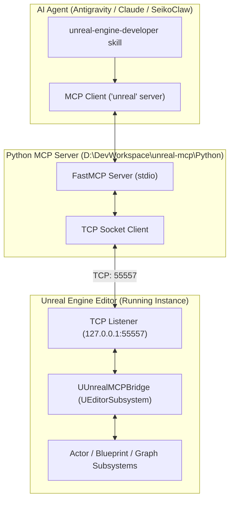
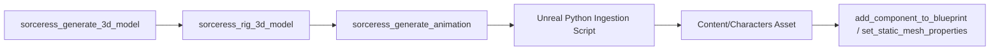

# Unreal Engine Developer & Editor MCP Orchestrator

The **Unreal Engine Developer** skill provides autonomous, bi-directional control over a live running Unreal Engine editor instance (UE 5.5, 5.7, 5.8+) via the Model Context Protocol (MCP). It translates high-level game architecture, design documents, and mathematical balance models directly into live Unreal assets, level geometry, and wired Blueprint graphs without manual editor friction.

---

## 1. System Architecture & Connection Protocol



### Connection Requirements:
1. **Unreal Editor Must Be Running**: The project (`.uproject`) must be open in the Unreal Editor.
2. **UnrealMCP Plugin Active**: The `UnrealMCP` plugin must be present in the project's `Plugins/UnrealMCP` folder (or installed as an engine plugin) and enabled.
3. **TCP Listener**: Upon editor startup, `UUnrealMCPBridge` automatically initializes and listens on `127.0.0.1:55557`.
4. **Agent MCP Server**: The `unreal` MCP server is registered in `~/.gemini/antigravity/mcp_config.json` via `uv run unreal_mcp_server.py`.

---

## 2. Core Tool Reference

All Unreal MCP tools are invoked via the `unreal` MCP server:

### A. Level Layout & Actor Management
- `find_actors_by_name(name)`: Query if an actor exists before creating or transforming it.
- `get_actors_in_level()`: List all actors currently populated in the active persistent level.
- `create_actor(name, type, location, rotation, scale)`: Spawn actors (`CUBE`, `SPHERE`, `PLANE`, `CYLINDER`, `CONE`, `CAMERA`, `LIGHT`, `POINT_LIGHT`, `SPOT_LIGHT`).
- `set_actor_transform(name, location, rotation, scale)`: Precision placement in Unreal units (cm) and degrees.
- `get_actor_properties(name)`: Read transform, tags, and actor properties.
- `delete_actor(name)`: Clean up obsolete or temporary actors.

### B. Blueprint Construction & Assembly
- `create_blueprint(name, parent_class)`: Generate new Blueprint classes (parent classes: `Actor`, `Pawn`, `Character`, `GameModeBase`).
- `add_component_to_blueprint(blueprint_name, component_type, component_name, location, rotation, scale)`: Add components (`StaticMeshComponent`, `BoxComponent`, `SphereComponent`, `CameraComponent`, `SpringArmComponent`).
- `set_static_mesh_properties(blueprint_name, component_name, mesh_path, material_path)`: Bind 3D mesh assets and materials.
- `set_physics_properties(blueprint_name, component_name, simulate_physics, gravity_enabled, mass, linear_damping, angular_damping)`: Configure rigid-body physics.
- `set_pawn_properties(blueprint_name, auto_possess_player, use_controller_rotation_yaw, ...)`: Configure player controller possession and rotation inheritance.
- `set_blueprint_property(blueprint_name, property_name, property_value)`: Update default class variable values.
- `compile_blueprint(blueprint_name)`: **Mandatory**: Recompile the Blueprint to bake changes.
- `spawn_blueprint_actor(blueprint_name, actor_name, location, rotation, scale)`: Spawn an instance of the compiled Blueprint into the level.

### C. Visual Scripting & Node Graph Wiring
- `add_blueprint_event_node(blueprint_name, event_type, node_position)`: Add lifecycle hooks (`BeginPlay`, `Tick`, custom events).
- `add_blueprint_input_action_node(blueprint_name, action_name, node_position)`: Add input execution pins.
- `add_blueprint_function_node(blueprint_name, target, function_name, params, node_position)`: Add callable function nodes (`PrintString`, `SetActorLocation`, `ApplyDamage`).
- `connect_blueprint_nodes(blueprint_name, source_node_id, source_pin, target_node_id, target_pin)`: Connect execution or data lines between graph nodes.
- `add_blueprint_variable(blueprint_name, variable_name, variable_type, default_value, is_exposed)`: Declare typed variables (`Boolean`, `Integer`, `Float`, `Vector`, `String`).
- `create_input_mapping(action_name, key, input_type)`: Bind keyboard/mouse/gamepad inputs to action names.
- `find_blueprint_nodes(blueprint_name, node_type, event_type)`: Inspect node IDs in the event graph for connection wiring.

### D. Viewport & Camera Diagnostics
- `focus_viewport(target, location, distance, orientation)`: Frame target actors or locations in the active editor camera viewport.

---

## 3. Production Pipelines

### Pipeline 1: Full Game Forge Integration (`game-forge` Stage E)
When executing Stage E of `/game-forge` targeting Unreal Engine:
1. **Ingest Game Design & Specs**: Read `docs/design/GDD.md` and `docs/design/micro_slice.md`.
2. **Scaffold World Geometry**: Spawn arena bounds, collision boundaries, player spawn point, and environment lighting using `create_actor` and `set_actor_transform`.
3. **Build Player Character**:
   - `create_blueprint(name="BP_PlayerCharacter", parent_class="Character")`
   - Add camera and spring arm components.
   - Configure Enhanced Input mappings using `create_input_mapping`.
   - Wire movement logic into the Event Graph via `add_blueprint_function_node` and `connect_blueprint_nodes`.
   - `compile_blueprint("BP_PlayerCharacter")`
4. **Build Enemy Entities**:
   - Create `BP_EnemyBase` with static mesh/skeletal mesh and collision box.
   - Add health, attack damage, and aggro radius variables via `add_blueprint_variable`.
   - Wire damage reception logic (`Event AnyDamage` -> update health).
   - Compile and spawn into combat patrol zones.
5. **Compile & Spawn**: Place instances into the scene and frame them with `focus_viewport`.

### Pipeline 2: Sorceress 3D Asset Pipeline
Connect assets generated by the [`sorceress`](file:///C:/Users/saiko/.gemini/config/skills/sorceress/SKILL.md) MCP server directly into Unreal Engine:

1. Generate model with `sorceress_generate_3d_model` and download `.glb`/`.fbx`.
2. Ingest into Unreal `/Game/Content/` using the Unreal Python scripting module:
   ```python
   import unreal
   task = unreal.AssetImportTask()
   task.filename = "D:/path/to/character.fbx"
   task.destination_path = "/Game/Characters"
   unreal.AssetToolsHelpers.get_asset_tools().import_asset_tasks([task])
   ```
3. Assign imported mesh to the character Blueprint using `set_static_mesh_properties`.

### Pipeline 3: Systems Modeler Balance Synchronization
Connect mathematical models from [`game-systems-modeler`](file:///d:/DevWorkspace/SeikoClaw-Harness/.agents/skills/game-systems-modeler/SKILL.md) (`docs/design/balance.json`):
1. Parse authoritative combat formulas (TTK, Damage scaling, XP curves).
2. Generate Unreal `DataTable` JSON / CSV schemas matching `FCombatBalanceRow` or `FProgressionRow`.
3. Import into Unreal DataTables or populate Blueprint default properties via `set_blueprint_property`.

---

## 4. Execution Rules & Best Practices

1. **Existence Verification First**:
   - Always run `find_actors_by_name` before modifying or deleting an actor.
   - Always verify if a Blueprint already exists before calling `create_blueprint`.
2. **Strict Compilation Discipline**:
   - Every modification to components, variables, or graph nodes leaves the Blueprint in a dirty state.
   - **Always call `compile_blueprint(blueprint_name)`** immediately after completing a batch of graph or component edits before attempting to spawn it.
3. **Coordinate Conventions**:
   - Unreal Engine units are **centimeters** ($100\text{ units} = 1\text{ meter}$).
   - World coordinates: $+X$ is Forward, $+Y$ is Right, $+Z$ is Up.
   - Rotations: `[Pitch, Yaw, Roll]` in degrees.
4. **Node Layout Discipline**:
   - Provide spaced grid positions for `node_position: [X, Y]` when adding event nodes and function nodes (e.g. step by $+250$ on $X$ for sequential flow) so graphs remain clean for human designers.

---

## 5. Troubleshooting & Health Checks

| Symptom | Cause | Remediation |
| :--- | :--- | :--- |
| **`ConnectionRefusedError: [WinError 10061]`** | Unreal Editor is closed or plugin not initialized | Open the `.uproject` in Unreal Editor. Check that `UnrealMCP` plugin is enabled in `Edit > Plugins`. |
| **`Socket timeout during receive`** | Editor frozen in heavy compile or modal dialog open | Dismiss any blocking modal dialogs in the Unreal Editor viewport; check `Saved/Logs` in project root. |
| **`Failed to find component`** | Component name mismatch or compile pending | Ensure component was added via `add_component_to_blueprint` and check exact component name string. |
| **`Plugin rebuild required on launch`** | Engine version mismatch between UE 5.5 and 5.8 | Right-click `.uproject` > *Generate Visual Studio project files* and build `Development Editor` in Visual Studio. |
